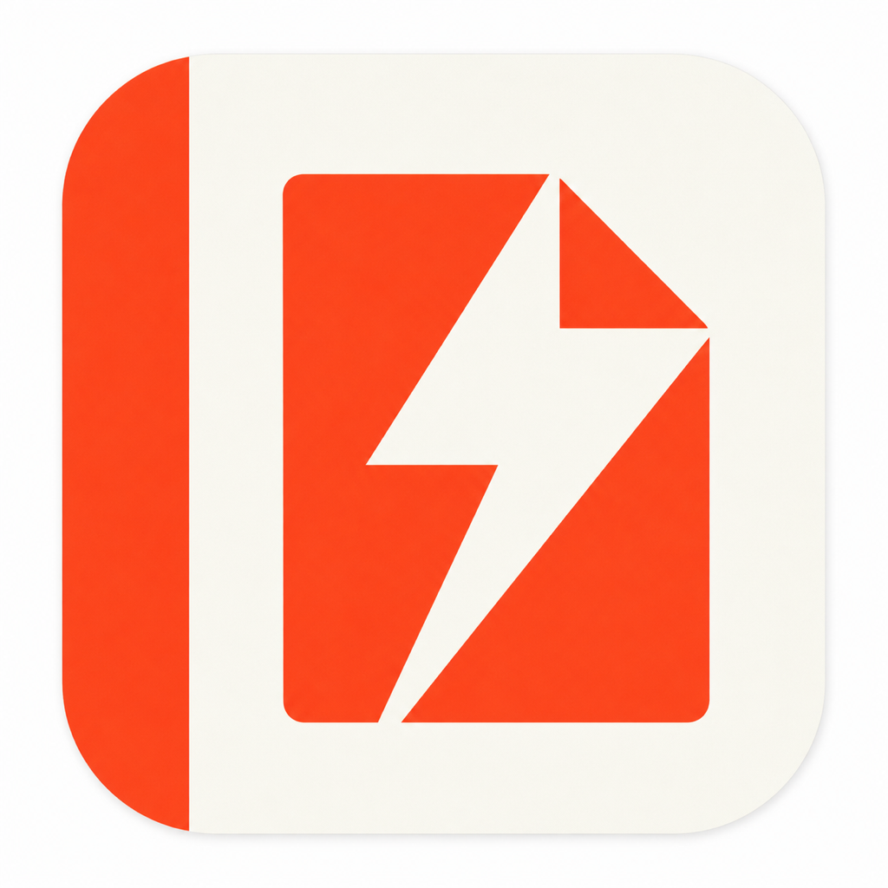

#  FlashNote

> 📖 English version: [README](../README.md)

一款轻量、跨平台（macOS 与 Windows）的速记桌面应用，通过全局快捷键即时捕捉灵感与待办 —— 别让好点子溜走。

基于 **Tauri v2 + TypeScript** 构建，无前端框架，发布包仅几 MB。

---

## 功能特性

- **⚡ 全局快捷键** —— 在任何界面唤起/收起速记输入框。默认 `Cmd/Ctrl + Shift + A`，可自由重新绑定。
- **💡 灵感 vs. 待办** —— 每条笔记可标记为*灵感*或*待办*，待办可勾选完成。
- **📅 按天 JSON 持久化** —— 每条笔记本地存储在 `YYYY-MM-DD.json`，一天一个文件。可读性强，便于备份或同步。
- **🔎 日 / 周 / 月历史** —— 将鼠标滑到窗口底部边缘，历史面板即会展开；可按日、周、月筛选。移开鼠标即收起。
- **🎛️ 随处可改设置** —— 通过系统托盘菜单或窗口内的齿轮按钮修改快捷键。按键捕捉可实时录制组合键，保存后立即生效。
- **🪶 速记输入体验** —— 无边框、半透明、始终置顶的窗口，失焦自动隐藏，绝不碍事。

---

## 为什么选 FlashNote？—— 体积对比

大多数记事桌面应用基于 **Electron** 构建，需要打包完整的 Chromium 运行时，因此安装包动辄 **100–240 MB**。FlashNote 基于 **Tauri**，复用操作系统原生 webview，整个 macOS `.dmg` 仅 **≈ 4.6 MB**。

| 应用 / 项目                                                                                                              | 技术栈          | 安装包 / 打包体积                     | 体积来源             |
| ------------------------------------------------------------------------------------------------------------------------ | --------------- | ------------------------------------- | -------------------- |
| **⚡ FlashNote**                                                                                                   | **Tauri** | **≈ 4.6 MB**（macOS `.dmg`） | 本仓库               |
| [Obsidian](https://forum.obsidian.md/t/obsidian-for-windows-1-6-5-installer-increased-in-size-from-79-mb-to-236-mb/84322) | Electron        | ≈ 236 MB（Windows 安装包）           | Obsidian 论坛帖      |
| [Logseq](https://github.com/logseq/logseq/releases)                                                                       | Electron        | ≈ 190 MB（macOS arm64`.dmg`）      | GitHub releases      |
| [Joplin](https://github.com/laurent22/joplin/releases)                                                                    | Electron        | ≈ 148 MB（macOS arm64`.dmg`）      | GitHub releases      |
| [Simplenote](https://sourceforge.net/projects/simplenote-for-electron.mirror/files/)                                      | Electron        | ≈ 143 MB（Linux arm64`.tar.gz`）   | SourceForge 发布镜像 |
| [TriliumNext Notes](https://github.com/TriliumNext/Notes/releases)                                                        | Electron        | ≈ 119 MB（Linux`.deb`）            | GitHub releases      |

> 以上体积均取自对应官方发布/下载页面（已核实，非估算）。相较之下，FlashNote 的 4.6 MB 打包体积约小 **26×–51×**，是一款真正轻量的速记工具。

---

## 快速开始

```bash
# 安装前端依赖
npm install

# 开发模式运行（热重载）
npm run tauri:dev

# 构建生产包
#   macOS -> .app + .dmg（.app 会同时自动安装到 /Applications）
#   Windows -> .msi / .exe
# 构建产物会复制到 release/<version>/（已被 git 忽略）
npm run tauri:build
```

---

## 技术栈

| 层级   | 选型                                   |
| ------ | -------------------------------------- |
| 外壳   | [Tauri v2](https://tauri.app/)（Rust）  |
| 前端   | 原生 TypeScript + Vite                 |
| 存储   | 操作系统应用数据目录下的按天 JSON 文件 |
| 快捷键 | `tauri-plugin-global-shortcut`       |
| 日期   | `chrono`（Rust）                     |

---

## 环境要求

- [Node.js](https://nodejs.org/) 18+
- [Rust 工具链](https://www.rust-lang.org/tools/install)（stable）+ Cargo
- 按 [Tauri 环境准备指南](https://tauri.app/start/prerequisites/) 安装各平台构建依赖

---

## 使用说明

1. 启动应用 —— 它常驻**系统托盘 / 菜单栏**，未被唤起时保持隐藏。
2. 按 **`Cmd/Ctrl + Shift + A`** 打开速记输入框。
3. 输入笔记，在顶部切换**灵感 / 待办**，按 **Enter** 保存（窗口自动隐藏）。
4. 再次按快捷键，然后**将鼠标滑到底部边缘**显示历史。可按**日 / 周 / 月**筛选、勾选待办或删除条目。
5. 按 **Esc** 或点击别处即可收起。

### 修改快捷键

从以下任一入口打开**设置**：

- **托盘图标** → 右键 → *设置…*，或
- 速记窗口右上角的**齿轮 ⚙ 按钮**。

点击捕捉框，按下想要的组合键（必须为**一个或多个修饰键 + 一个主键**，如 `⌘⇧A`），然后**保存**，新快捷键会立即注册。

---

## 数据存储位置

笔记以每天一个 JSON 文件的形式，存储在操作系统的应用数据目录下：

| 系统    | 路径                                                      |
| ------- | --------------------------------------------------------- |
| macOS   | `~/Library/Application Support/<app-identifier>/notes/` |
| Windows | `%APPDATA%\<app-identifier>\notes\`                     |

每个文件（`YYYY-MM-DD.json`）是一个笔记对象数组：

```json
[
  {
    "id": "1720000000000-0",
    "text": "Ship the FlashNote MVP",
    "type": "todo",
    "done": false,
    "ts": 1720000000000
  }
]
```

设置（快捷键）保存在应用配置目录下的 `settings.json` 中。

---

## 项目结构

```
flashnote/
├── index.html            # 速记输入窗口入口
├── settings.html         # 设置窗口入口
├── vite.config.ts        # 多页面 Vite 配置
├── assets/
│   ├── icon-source.png   # 用于生成应用图标的源图
│   └── README.zh-CN.md   # 中文说明文档
├── src/                  # 前端（TypeScript）
│   ├── main.ts           # 速记输入 + 历史逻辑
│   ├── styles.css
│   ├── settings.ts       # 设置面板 + 按键捕捉
│   └── settings.css
├── release/              # 构建产物，按版本分目录（已被 git 忽略）
│   └── <version>/        # 如 release/0.2.0/ -> FlashNote.app + .dmg
└── src-tauri/            # Rust 后端
    ├── src/lib.rs        # 命令、托盘、全局快捷键、持久化
    ├── src/main.rs
    ├── capabilities/     # Tauri 权限集
    ├── icons/            # 生成的应用图标
    └── tauri.conf.json
```

---

## 许可协议

MIT
